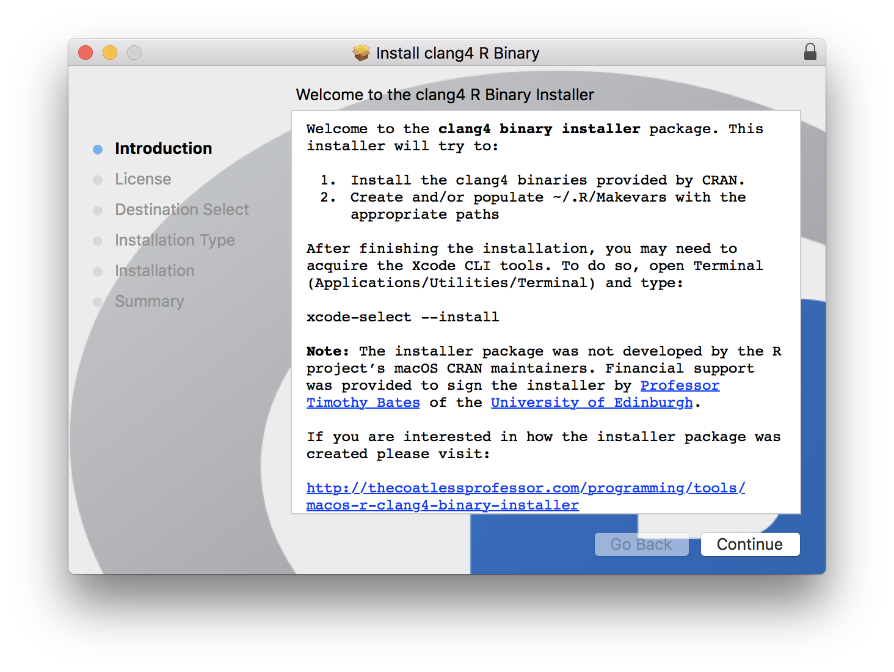
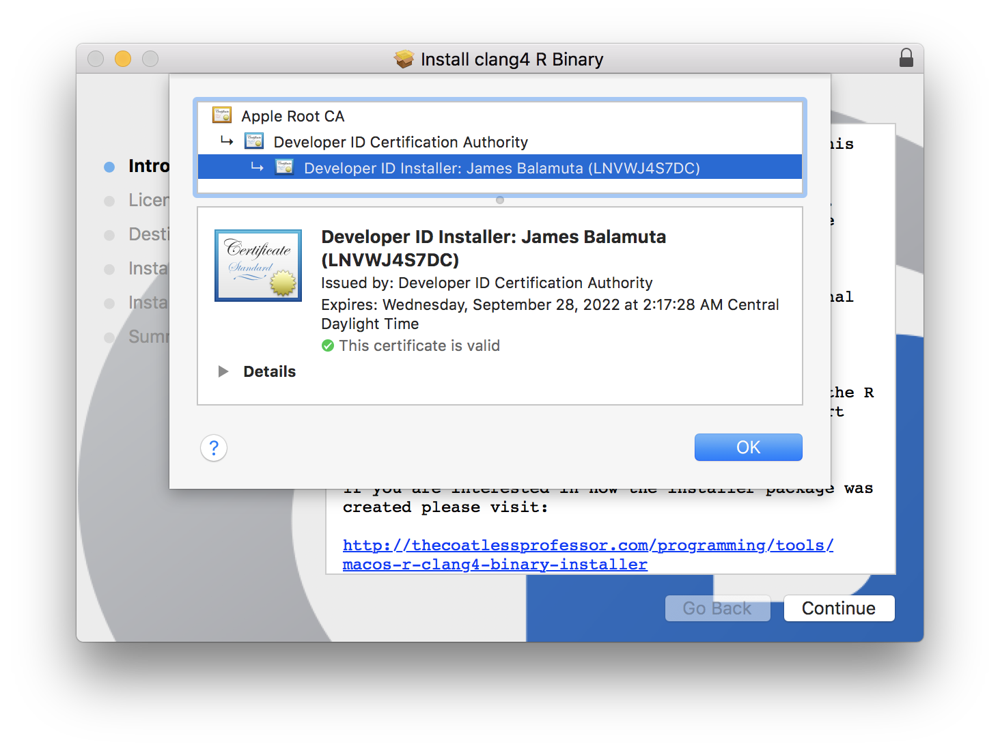

**This installer has been superceded by the 
[r-macOS-rtools installer](https://github.com/coatless/r-macos-rtools),
which automatically installs and configures the _R_ toolchain for
compiled code on macOS, e.g. XCode Command Line Tools, `clang4`, 
and `gfortran`.**

# Installer Package for `clang4` R Binaries [](http://www.gnu.org/licenses/gpl-2.0.html)

The repository contains the scripts used to create a macOS installer package (`.pkg`)
for the `clang4` binaries. For those interested, the installer can be obtained
on either the project's [Release page](https://github.com/coatless/r-macos-clang/releases/latest)
or through <http://go.illinois.edu/r-macos-clang-pkg>. 

The pre-built binaries this installer setups during the installation
can be found at: <http://r.research.att.com/libs/>. 

The scripts have the potential to be generalized further so that 
`.pkg` installers are available to be created for all binaries
listed on <http://r.research.att.com/libs/>.

**Financial support was provided to sign the installer by 
[Professor Timothy Bates](http://www.ed.ac.uk/profile/timothy-bates) 
of the [University of Edinburgh](http://www.ed.ac.uk/).**

## How do I use the installer? 

Download it from <http://go.illinois.edu/r-macos-clang-pkg>, open the 
installer by right clicking to bring up menu and selecting "Open". 
From here, navigate through it like a normal macOS installer.

If you have yet to install
[Xcode Command Line Interface Tools ("Xcode CLI")](https://developer.apple.com/library/content/technotes/tn2339/_index.html#//apple_ref/doc/uid/DTS40014588-CH1-WHAT_IS_THE_COMMAND_LINE_TOOLS_PACKAGE_), 
you will then need to open Terminal (Applications/Utilities/Terminal) 
and type:

```bash
xcode-select --install
```

**That's it.** Once installed, you can start using compiled code
in _R_ like normal with the added benefit of `OpenMP`.

If you want to see behind the curtain, continue reading...

## What does the installer do?

The `clang4-r` installer performs two actions that require
the users password to accomplish. These actions are:

1. unpack a set of pre-made binary files into 
    the `/usr/local/clang4` directory
2. establish the proper paths for `CC`, `CXX`, `CXX**`,
    and `LDFLAGS` in the  `~/.R/Makevars` file

In essence, it provides a graphical user interface installation guide,
more secure path manipulation, and a smarter handling of a pre-existing `~/.R/Makevars`
when compared to the following pure _bash_ approach:

```bash
# Download binary
curl -O http://r.research.att.com/libs/clang-4.0.0-darwin15.6-Release.tar.gz
# Extract binary onto root directory
tar fvxz clang-4.0.0-darwin15.6-Release.tar.gz -C /

# Overwrites ~/.R/Makevars file if present otherwise creates it
cat <<- EOF > ~/.R/Makevars
# The following statements are required to use the clang4 binary
CC=/usr/local/clang4/bin/clang
CXX=/usr/local/clang4/bin/clang++
CXX1X=/usr/local/clang4/bin/clang++
CXX98=/usr/local/clang4/bin/clang++
CXX11=/usr/local/clang4/bin/clang++
CXX14=/usr/local/clang4/bin/clang++
CXX17=/usr/local/clang4/bin/clang++
LDFLAGS=-L/usr/local/clang4/lib
# End clang4 inclusion statements
EOF

# Install Xcode CLI tools
xcode-select --install
```

## Verify the Installer

Thanks to the **financial support provided by [Professor Timothy Bates](http://www.ed.ac.uk/profile/timothy-bates) of
the [University of Edinburgh](http://www.ed.ac.uk/)** to join the [Apple Developer program](https://developer.apple.com/).
The installer is now signed using [developer credentials](https://developer.apple.com/library/content/documentation/IDEs/Conceptual/AppDistributionGuide/MaintainingCertificates/MaintainingCertificates.html).

As a result, the installer should have a "lock" icon in the upper right corner:



Clicking the lock icon will reveal the signed developer certificate:



With this being said, the code used to generate the installer has been made publically available under an open source license (GPL >= 2). 

## Overview of Files

Below is an abridged version of the actions of each file provided.

- `download_files.sh`
   - Downloads the `clang-4.0.0-darwin15.6-Release.tar.gz` from
    <http://r.research.att.com/libs/> and extracts it into a temporary `ROOT/` directory 
	established in the working directory
- `scripts/postinstall`
   - Create or modify the `~/.R/Makevars` file with the necessary implicit variables
     to compile with _clang4_.
   - This is run at the _end_ of the installer routine.
- `make_installer.sh`
   - Create the installer package R binary installer `.pkg`
      - Builds the package from the extracted tar using `pkgbuild` 
      - Analyzing the package using `productbuild` to create a `distribution.xml`   
	  - Inserts customizations into the `distribution.xml` (title, background, ...)
	  - Calls `productbuild` to rebuild the package.
- `distribution.xml`
   - Customization options (e.g. title, background) of installer built by analyzing a temporary .pkg
- `build_files/Rlogo.png`
   - R logo
- `build_files/LICENSE.rtf`
   - License of the LLVM installer
- `build_files/WELCOME_DISPLAY.rtf`
   - Text displayed on welcome screen

# License

GPL (>= 2) 
